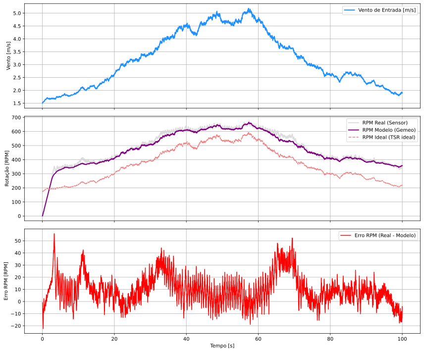
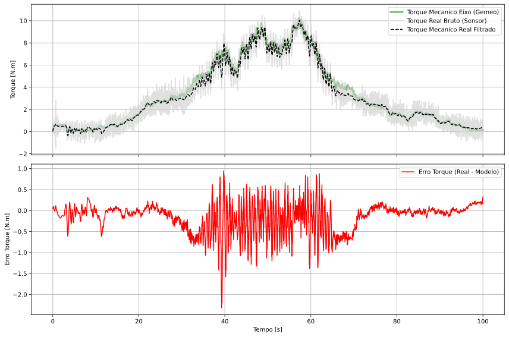
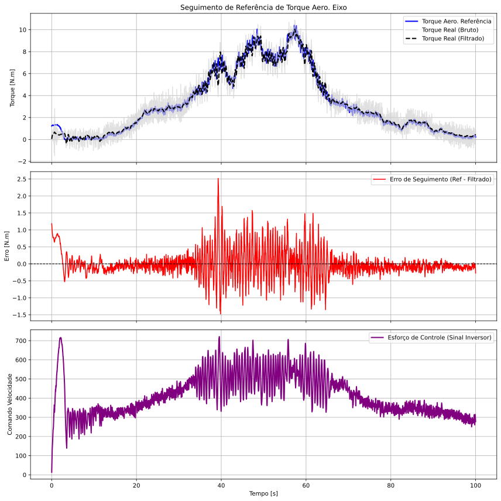
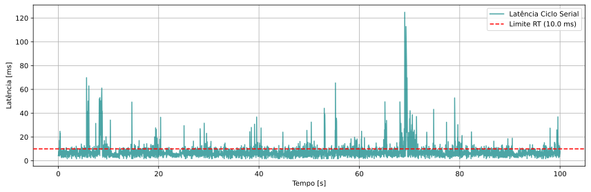

# 💨 WindTwin-HIL: Emulação de Aerogeradores e Gêmeo Digital em Tempo Real

## 📋 Descrição do Projeto
O **WindTwin-HIL** é uma plataforma de engenharia para emulação eletromecânica e desenvolvimento de **Gêmeos Digitais (Digital Twins)** aplicados a turbinas eólicas. O projeto resolve um problema crítico no desenvolvimento de energias renováveis: a validação de algoritmos de controle complexos (como MPPT de rastreamento e controle de passo) e a análise dinâmica do comportamento mecânico/elétrico sem a necessidade de acessar uma turbina eólica física real ou depender de túneis de vento dispendiosos.

Utilizando o conceito de **Hardware-in-the-Loop (HIL)**, o sistema acopla em tempo real um modelo matemático de uma turbina virtual a uma bancada física composta por um motor elétrico acionado por um inversor de frequência industrial e instrumentada com um torquímetro de alta precisão. Isso permite simular perfis complexos de vento (como rajadas naturais, degraus e velocidades constantes) e analisar instantaneamente a resposta dinâmica de velocidade, torque, potência gerada e transições elétricas do barramento.

---

## 🛠️ Tecnologias e Dependências

O núcleo do projeto foi construído utilizando Python estruturado, priorizando o processamento de sinais de forma determinística e controle de tempo real.

### Bibliotecas e Tecnologias Principais:
* **NumPy**: Utilizado para computação vetorial de alto desempenho, manipulação das matrizes de amostragem de dados e cálculos algébricos das equações diferenciais da turbina.
* **Matplotlib (pyplot)**: Ferramenta responsável pela renderização dos gráficos dinâmicos de pós-processamento, permitindo a análise visual das curvas cinemáticas, latências e torques.
* **Módulo Time**: Utilizado para cronometragem precisa (`time.perf_counter()`), regulação das taxas de amostragem e cálculo de latências do sistema.

### Arquitetura de Módulos Desenvolvidos:
* `modelo_aerogerador.py`: Contém a classe `TurbinaVirtual`, que implementa as equações dinâmicas de aerodinâmica, inércia equivalente acoplada, perdas rotacionais por atrito, dinâmica indutiva da armadura do gerador e comportamento dinâmico do capacitor do barramento CC.
* `parametros.py`: Centraliza os parâmetros físicos e elétricos identificados previamente na bancada de testes por meio de ensaios específicos ou ajustes de modelo.
* `pid_module.py`: Implementa uma classe responsavel pelo modulo que orquestra os controladores Proporcionais-Integratovos-Derivativos (PID) no sistema.
* `driver_inversor_cfw11.py` & `driver_torquimetro.py`: Drivers desenvolvidos em nível de aplicação para prover comunicação serial robusta com o inversor industrial WEG e o hardware do torquímetro.
* `init_serial_devices.py`: Script auxiliar automatizado para escaneamento, filtragem e seleção dinâmica das portas COM/TTY associadas à instrumentação da bancada.

---

## Configuração do Hardware (Apenas para o ensaio HIL completo):
    Garanta que o inversor de frequência WEG CFW11 e o torquímetro eletrônico estão energizados e conectados aos barramentos seriais (USB/RS485) do computador de controle antes de inicializar o script HIL.

---

### Detalhamento dos Scripts

### 1. `main_emulador_&_gemeo.py`
* **O que faz:** É o script mestre do sistema Hardware-in-the-Loop. Ele realiza a ponte em tempo real entre o modelo virtual e a bancada física. O script inicializa as conexões com o inversor e o torquímetro, injeta o perfil de velocidade de vento selecionado, lê o torque real medido pelo hardware, atualiza os estados da `TurbinaVirtual` e envia instantaneamente a nova referência de velocidade angular para o inversor de frequência industrial. Adicionalmente, computa estatísticas detalhadas sobre a latência de comunicação da bancada.
* **Comando para executar:**
    ```bash
    python "main_emulador_&_gemeo.py"
    ```

### 2. `main_gemeo_pid.py`
* **O que faz:** Script voltado para simulação numérica em malha fechada pura (Pure Software Simulation). Ele instancia o gêmeo digital (`TurbinaVirtual`) e aplica o controlador PID configurado em `pid_module.py` para simular as transições dinâmicas de vento e respostas de potência. É essencial para testar novas estratégias de controle.
* **Comando para executar:**
    ```bash
    python main_gemeo_pid.py
    ```

### 3. `modelo_aerogerador.py`
* **O que faz:** Encapsula a classe estrutural `TurbinaVirtual`. Modela fenômenos físicos complexos como a potência absorvida do vento ($P_{wind} = 0.5 \cdot \rho \cdot \pi R^2 \cdot v^3 \cdot C_p$), torque aerodinâmico, perdas por efeito Joule na armadura e cálculo dinâmico da tensão do capacitor de barramento. Também implementa a lógica das transições de estado automáticas do algoritmo MPPT (ex: acionamento e conexão de carga ao registrar tensões superiores a 90V por mais de 5 segundos). *Nota: Este script funciona como biblioteca de classes e não deve ser executado diretamente.*

### 4. `parametros.py`
* **O que faz:** Script de configuração estática contendo os coeficientes obtidos por identificação paramétrica experimental. Define parâmetros críticos do sistema como a constante de velocidade do gerador ($2.6757 \text{ V}\cdot\text{rad/s}$), offset de Força Eletromotriz ($9.5104\text{ V}$), resistência de armadura ($25.0\ \Omega$), inércia do rotor e os limites de segurança mecânica (`TAXA_VARIACAO_RPM_MAX = 100`). *Nota: Arquivo de configuração, não executável.*

---

## 📊 Resultados e Visualizações

Os ensaios realizados sob a imposição do perfil de vento dinâmico denominado **NATURAL** geraram o seguinte conjunto de dados gráficos de alta fidelidade:

### 📈 Resposta Cinemática do Sistema
Este gráfico ilustra a aderência temporal precisa entre a velocidade do eixo do gerador no Gêmeo Digital e a velocidade angular real desenvolvida e monitorada pelo hardware físico da bancada em malha fechada.


### ⚙️ Dinâmica e Equilíbrio de Torques
Demonstração das curvas temporais do torque gerado no modelo dinamico frente ao torque eletromagnético e às perdas por fricção registradas nos sensores mecânicos durante a emulação ativa.


### 🎛️ Sinais de Controle e Seguimento de Referencia


### ⏱️ Análise do Perfil de Latência
Mapeamento estatístico do tempo gasto (em milissegundos) no ciclo completo de varredura (leitura de sensores seriais + processamento matemático do modelo + escrita de comandos no inversor). Essencial para comprovar o determinismo e viabilidade de tempo real do sistema HIL.


### 📄 Histórico Operacional e Transições
Conforme observado nos registros do sistema, o sistema detecta e reage com a eventos do modelo responsavel por gerar a referencia de torque que dita o controle do motor responsavel por emular o vento, e os tambem os eventos do Gemeo-Digital que se aproximam com uma precisao razoavel dos eventos reais da bancada, como por exemplo o tempo em que o inversor liga.

```text
=======================================================
=== HISTÓRICO DE EVENTOS DO SISTEMA (Vento 'Natural') ===
=======================================================
[1.643s] [HW] Coef. torque estático alterado para: False
[1.740s] [TWIN] Coef. torque estático alterado para: False
[8.048s] [MPPT] Inversor ligou (Tensão > 90V por 5.0s)
[8.048s] [TWIN] Flag vazio alterado para: False
=======================================================

=======================================================
=== HISTÓRICO DE EVENTOS DO SISTEMA (Vento Escada) ===
=======================================================
[11.004s] [HW] Coef. torque estático alterado para: False
[11.514s] [TWIN] Coef. torque estático alterado para: False
[20.000s] [TWIN] Coef. torque estático alterado para: True
[20.012s] [HW] Coef. torque estático alterado para: False
[20.069s] [TWIN] Coef. torque estático alterado para: False
[26.054s] [MPPT] Inversor ligou (Tensão > 90V por 5.0s)
[26.054s] [TWIN] Flag vazio alterado para: False
[86.405s] [MPPT] Inversor desligou! (Tensão caiu abaixo de 90V)
[86.405s] [TWIN] Flag vazio alterado para: True
=======================================================
